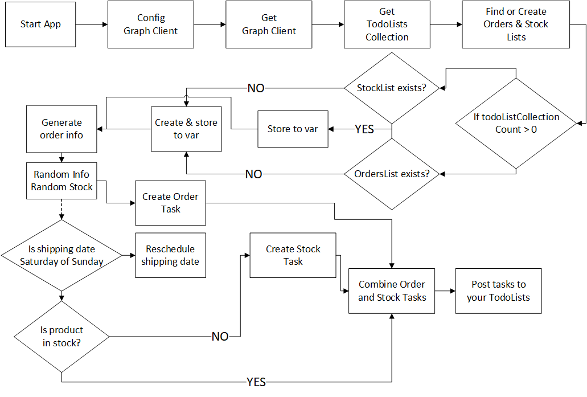

# Orders TODO

This code is a sample implementation of using Azure Graph API to manage tasks in a Todo List. It uses the Microsoft Graph .NET SDK to interact with the Graph API.

The main purpose of this code is to create and manage tasks in a Todo List. In this example, the code creates a Todo List named "Orders" if it doesn't exist and then adds a new task with random order details to the "Orders" list.

## Prerequisites
- An Azure account
- A registered application in Azure
- The client ID and tenant ID for the registered application
- Microsoft Graph .NET SDK (version 1.0)
- Azure.Identity package (version 1.8)

  

 

## Usage
- Clone the repository to your local machine.
- Open the solution in Visual Studio and update the `tenantId` and `clientId` variables with your Azure AD tenant and client IDs respectively.
- Run the code.

## Code Explanation
- The FindOrCreateOrdersList() and FindOrCreateStockList() methods check if the Orders and Stock lists already exist. If they do, the method returns the TodoTaskList. If they do not exist, the method creates the TodoTaskList and returns it.
- The GenerateNewOrder() method generates a new order with a random product, order number, quantity, and shipping date and randomly picks if the ordered product is in stock or not. If the product is not in stock, the method also generates a new task for restocking.
- If the generated shipping date falls on weekend then it is rescheduled for the following Mondays.
- The AddOrderToMyLists() method adds the new order and the restocking task (if applicable) to the Orders and Stock TodoLists using the PostAsync() method on the Tasks endpoint.
- The code will open a browser window prompting the user to sign in with their Azure AD credentials. Once authenticated, the code will access the Graph API and create a new Todo List named "Orders" (if it doesn't exist), and add a new task to the list with the random generated order details and will create a Stock task if the item ordered is not in stock.

## Note
This code is a sample implementation and should not be used in production environments without appropriate modifications and testing. Additionally, it assumes that the user has appropriate permissions to create and manage Todo Lists using the Graph API.

